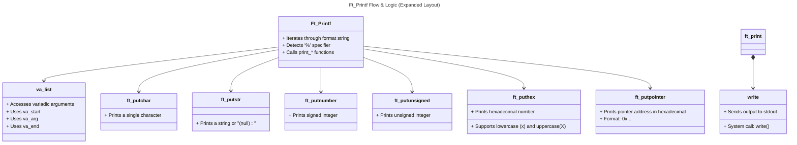

# 🖨️ FT_PRINTF – Recreating the Power of Writing in C

## ✍️ From Clay to Code: Writing as Power  
From the first Sumerian records carved into clay tablets to the dot-matrix printers of early home computing, writing has always been a tool for control, memory, and power.  
Created in 1972 with the C programming language by Dennis Ritchie, `printf` assumed the ancestral role of turning logic into visible language.  
By reconstructing this function in `ft_printf`, you're not just learning to program — you're reenacting the very history of civilization, line by line, byte by byte.

## 🏅 125% Performance in the Project

During the ft_printf project evaluation, I achieved the maximum score of 100%, the result of delivering all mandatory and bonus functionalities with precision, while fully meeting the technical standards required, including:

    ✅ Correct and efficient reimplementation of all standard printf behaviors
    ✅ Handling of complex format specifiers and flags
    ✅ Full compliance with Norminette coding standards
    ✅ Zero memory leaks (Valgrind clean)
    ✅ Implementation of bonus features, such as extended format support and robust edge-case handling

This score demonstrates not only deep understanding of C and formatted output logic, but also a strong commitment to code quality, performance, and low-level programming practices — essential values at the core of the 42 curriculum.

<p align="center">
  
</p>

## 💡 About the Project

`ft_printf` is a manual reimplementation of the classic C `printf` function. Without relying on standard formatting libraries (`<stdio.h>`), we’re challenged to build a robust system that accepts multiple types, formats strings, converts integers, hexadecimals, and pointers — all while respecting precision, flags, and more.




## 🧠 What You Will Master

While building `ft_printf`, I'll internalize fundamental low-level concepts that shape every high-performance language:

    ✅ Pointer manipulation and va_list
    ✅ Integer-to-string conversion (base 10, 16, and others)
    ✅ Buffer creation, counters, and flow control
    ✅ Modularization using structs and dispatch tables
    ✅ Full control over text formatting (without using printf!)

## 🚀 Technical Challenges Overcome

    ✅ Handling variadic arguments with stdarg.h
    ✅ Creating specific functions for each format type
    ✅ Converting negative integers without using itoa()
    ✅ Safe pointer printing with fallback to (nil)
    ✅ Accurate character return count (like the real printf)

# 📁 Project Structure
    📦 ft_printf  
    ┣ 📂 libft 
    ┃ ┣ 📜 ft_memset.c
    ┃ ┣ 📜 ft_bzero.c  
    ┃ ┣ 📜 ft_strncmp.c  
    ┃ ┗ 📜 ...
    ┃ 📜 ft_printf.c  
    ┃ 📜 ft_putchar.c  
    ┃ 📜 ft_putnumber.c  
    ┃ ┗ 📜 ...

## 📚 Key Functionalities

🔹 Manual Conversion – Total Control over Output

- `%c`: prints characters directly
- `%s`: handles strings, including NULL safety
- `%d`/`%i`: signed integers
- `%u`: unsigned integers
- `%x`/`%X`: hexadecimals (lowercase or uppercase)
- `%p`: pointer formatting with `0x` prefix
- `%%`: literal percent symbol

## 📖 Technical Glossary

| Concept            | Description |
|--------------------|-------------|
| `va_list`          | Type used to traverse variadic arguments |
| `va_start`         | Initializes the argument list |
| `va_arg`           | Accesses the next argument |
| `write`            | System call to print bytes |
| `itoa`             | Integer-to-string conversion (manual) |
| `%p`               | Pointer converter: prints memory addresses with `0x` |
| `recursion`        | Technique used to print numbers without buffer allocation |

---

## 🧠 Helpful Commands During Development

```
# Compile the project
make

# Clean compiled objects
make clean

# Clean all (including .a)
make fclean

# Recompile from scratch
make re
```

## 🧪 Compile and Test with a Custom Main

To test your implementation using your own main.c, you can compile it like this:

```
cc  main.c libftprintf.a 
```

    🔹 Make sure you have already run make so that libftprintf.a exists.
    🔹 The main.c file should include #include "ft_printf.h" to access your functions.
    🔹 It is acceptable to ignore warnings during compilation, as they are expected for testing the scope and analyzing the results of the project.
    
### 🌍 Vision and Impact

`ft_printf` is not just a technical exercise — it's a foundation. It teaches how complex systems interpret, translate, and display reality. From server logs to game console messages, every system communicates. And every digital communication begins with a `print`.

By building yours from scratch, you step into the heart of software engineering.

# 🚧 Tutorials (Coming Soon)

I'm currently working on a detailed tutorial to help others navigate the FT_PRINTF project more efficiently. This section will include:

    📹 Video Guide – A step-by-step walkthrough explaining key concepts and solutions.
    📄 PDF Guide – A structured document with explanations, tips, and best practices.

Stay tuned! The tutorial will be available soon. 🚀

# 🤝 Contributing

If you're also doing the Piscine, feel free to suggest improvements or share new approaches!

    📬 Contact: If you'd like to discuss solutions or exchange ideas, find me on Discord or GitHub!

<p align="center">
  <a href="https://github.com/allancrabelo" target="_blank" rel="noopener noreferrer">
    
  </a>
</p>

